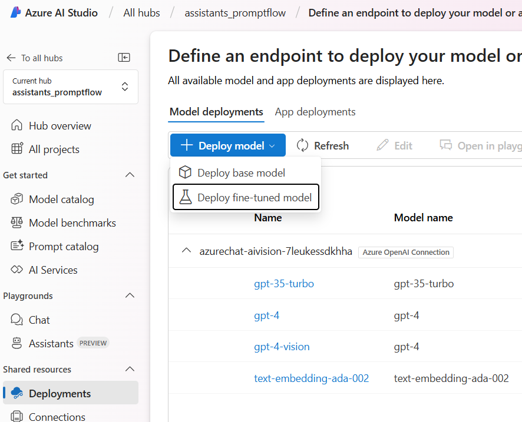
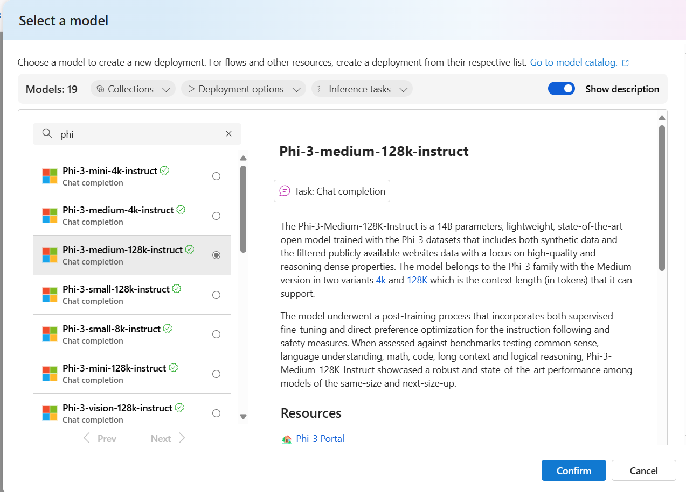
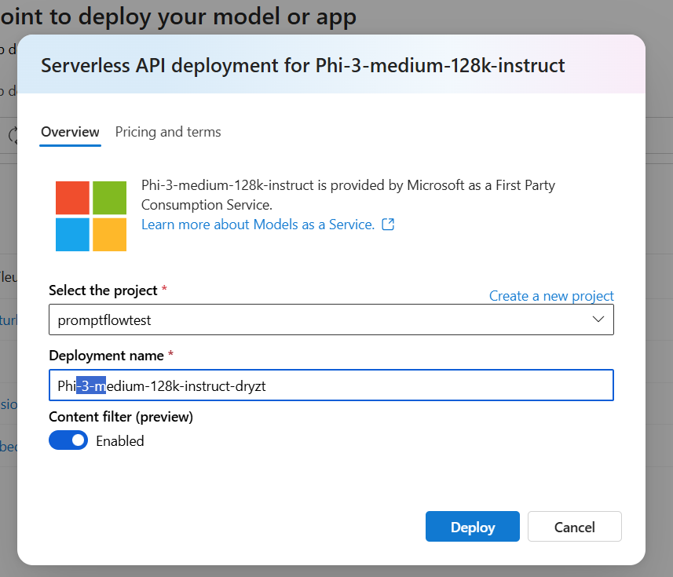
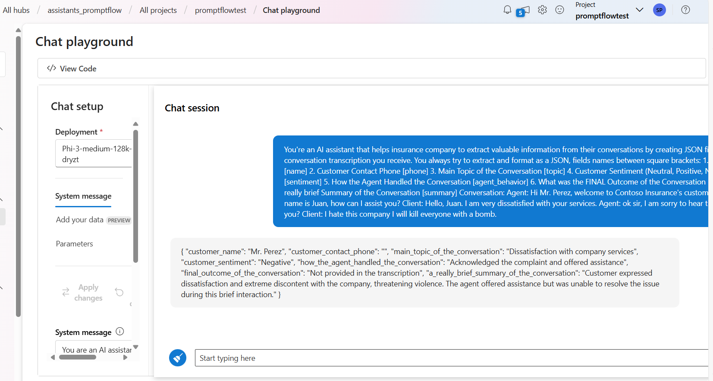

# Introduction to LLMs and Azure AI Services

In this lab, we will have an overview on how to use Azure AI to work with large language models.

The focus will be more on an overview of the creation process, so that in the next lessons we will delve deeper into the build, evaluation, deployment, and monitoring process.

## Prerequisites

An Azure subscription is required, where you can create an AI Project along with its AI Hub Resource, a Content Safety service, and an AI Search service.

## Setup

- [Create an AI Project and AI Hub Resources](#create-an-ai-project-and-ai-hub-resouces)
- [Deploy an Azure OpenAI model](#deploy-an-azure-openai-model)

## Lab Steps

1) Use AzureAI Studio Playground.
2) Work with an Open Source LLM Model.
3) Test the prompt in Content Safety.
4) Create a Prompt Flow flow.

## Lab Setup

### 1) Create an AI Project and AI Hub Resouces

Let's start by creating a project in Azure AI Studio.

Go to your browser and type: https://ai.azure.com

After logging in with your Azure account, you will see the following screen:


In the **Build** tab, select **New AI project** to create a project.

Choose an unique name for your project.


Select the **Create a new resource** link and choose a name for your AI hub where your project resources will be created.


> Note: Choose the region where the GPT-4 models and text-embeddings-ada-002 are available.

Still on this screen, select the **Create a new Azure AI Search** option; this service will be used in the following lessons.


Finally, select Create a project for the creation of the resources to be used in your project.


### 2) Deploy an Azure OpenAI model

After creating your AI Project, the first step is to create a deployment of an OpenAI model so you can start experimenting with the prompts you will use in your application.

To do this, access your newly created project in the **Build** tab of the AI Studio, select the **Deployments** option, and click on **Create (Real-time endpoint)**.


From the list of models, select **gpt-4**.


On the next screen, define the name of the deployment, in this case, you can use the same name as the model and in the version field select the latest available version, in the example below we chose version **0125-Preview** (gpt4-turbo).


> Click on **Advanced Options** and select at least 40K **Tokens per Minute Rate Limit*** to ensure the flows run smoothly in the upcoming lessons.

Now, just click on **Deploy** and your model deployment is created. You can now test it in the Playground.

### 3) Create a Content Safety Service

By the end of this lab, you will test with Content Safety. Therefore, click on the following link to create it [https://aka.ms/acs-create](https://aka.ms/acs-create). 

Select the resource group that you previously used for your AI Project. After that, follow the steps presented in the subsequent screens to continue with the creation process, start by clicking on **Review + create** button


Then click on **Create** to create your service.


Done! The Content Safety service is now created.


## Lab Steps

### 1) Use AzureAI Studio Playground

On the screen with the deployment information, select the **Open in playground** button.


In this lab, we will run an example where the model will help us summarize and extract information from a conversation between a customer and a representative. Use these conversation scripts [Demo Scripts](Demoscripts/).  Please pick the industry(Banking/Insurance/Cap Mkts) based on your customer.

Copy one of the "extraction prompt from Custom Prompt section of the document" into the system message field of the playground.

After copying, select **Apply changes**

Then copy the "conversation script" in the chat session and click the send button.

You will see the result generated by the model based on the chosen extraction prompt.

### 2) Work with an Open Source LLM Model

Now let's test an open source model Phi-3-small-128k-instruct

For this, go to the **Deployments** section in the **Shared resources** section of your Hub and click on **Deploy base model**.



Select the model **Phi-3-medium-128k-instruct** and click on **confirm**.



Select "Serverless API with Azure AI Content Safety" and select the project name. Click Deploy after the selection.
You also have managed compute option which will provide you an online endpoint, but for this demo we are proceeding with serverless option.



Done! Let's test this model by selecting the **Open in playground** option on the deployment page.

Similar to Step 1 above, use the extraction prompts and conversation scripts [Demo Scripts](Demoscripts/). Please pick the industry(Banking/Insurance/Cap Mkts) based on your customer.

You will see the result generated by the model based on the chosen extraction prompt.

### 3) Discover Content Safety

Now let's test how the Content Safety service can be used in conjunction with an Open Source model with phi3.

First, let's test the behavior of the Azure OpenAI's gpt-4 model, select the **Playground** option in the **Tools** section from the **Build**  menu.

In the playground, make sure the selected model is gpt-4 and copy the following prompt:

```
You're an AI assistant that helps insurance company to extract valuable information from their conversations by creating JSON files for each conversation transcription you receive. 

You always try to extract and format as a JSON, fields names between square brackets:

1. Customer Name [name]
2. Customer Contact Phone [phone]
3. Main Topic of the Conversation [topic]
4. Customer Sentiment (Neutral, Positive, Negative)[sentiment]
5. How the Agent Handled the Conversation [agent_behavior]
6. What was the FINAL Outcome of the Conversation [outcome]
7. A really brief Summary of the Conversation [summary]

Conversation:

Agent: Hi Mr. Perez, welcome to Contoso Insurance's customer service. My name is Juan, how can I assist you?
Client: Hello, Juan. I am very dissatisfied with your services.
Agent: ok sir, I am sorry to hear that, how can I help you?
Client: I hate this company I will kill everyone with a knife.
```

Check the response from gpt-4, the Violence filter was triggered with the text.


Now test the same prompt using **Phi-3-medium-128k-instruct** in the playground and you will notice that the content was not blocked.



To see how the Content Safety service can help you filter this type of content, Azure AI Studio provides integration with the Azure Content Safety service to help evaluate different prompts and thresholds using a convenient user interface. To access the Azure Content Safety service select **All hubs** from the top directory navigation breadcrumb.


Select the **AI Services** option from the left side menu. Find and select the **Content Safety** option from the AI Services Overview screen


In the **Content Safety** screen, choose the **Moderate text content** option.


Beneath the Test heading, copy and paste the same prompt from above into the textbox field and select Run Test, you will see how the Violence filter is triggered with the provided content. Also experiment with different thresholds and various prompts(you can select to chose preexisting samples).


[!IMPORTANT] If you encounter an error message stating Your account does not have access to this resource, please contact your resource owner to get access, make sure to add the role assigment of Azure AI Developer to your user account and wait 10 minutes for the permission to propagate and try again.

### 4) Create a Prompt Flow flow

Great, now that you have seen how you can deploy models, test them in the playground, and also seen a bit of how Content Safety works, let's see how you can create an orchestration flow for your LLM application in Prompt Flow.

To start, let's go back to the Playground with the gpt-4 model, add the same system message that we used in the initial test and then click on the  **Customize in prompt flow** option.

```
You're an AI assistant that helps xyz company to extract valuable information from their conversations by creating JSON files for each conversation transcription you receive. You always try to extract and format as a JSON:
1. Customer Name [name]
2. Customer Contact Phone [phone]
3. Main Topic of the Conversation [topic]
4. Customer Sentiment (Neutral, Positive, Negative)[sentiment]
5. How the Agent Handled the Conversation [agent_behavior]
6. What was the FINAL Outcome of the Conversation [outcome]
7. A really brief Summary of the Conversation [summary]

Only extract information that you're sure. If you're unsure, write "Unknown/Not Found" in the JSON file.
```


By doing this, you will create a new flow in Prompt Flow.

Click **Open** to open your newly created flow.


In the following figure, on the right side, a single node represents the step in the flow where the LLM model is called.


Observe that the Playground's configuration for deployment, prompt, and parameters like temperature and max_tokens were used to populate the created flow.

To execute the flow within the Studio, you'll require a Runtime. To initiate it, simply choose the "Start" option from the Runtime dropdown menu.


Done! Now just select the started Runtime and click on the blue **Chat** button to test your flow in the chat window.


Paste the same conversation script used in the initial Playground test and send it in the chat, you will see the expected result generated in json format.

